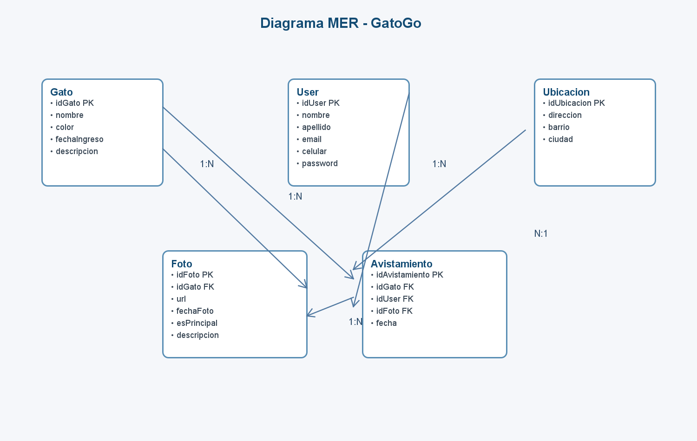

# GatoGo

    

## Cabecera

- Nombre del proyecto: GatoGo
- Estado: En desarrollo / listo para pruebas locales

## Resumen Ejecutivo

GatoGo es una aplicación web desarrollada con Java y Vaadin, orientada a la gestión de información relacionada con gatos, ubicaciones, usuarios, fotografías y avistamientos. La solución permite registrar y consultar datos clave de cada entidad mediante una interfaz de administración intuitiva y modular, con formularios, botones de CRUD y tablas de visualización.

El sistema está pensado como una base funcional para proyectos de seguimiento de gatos, reportes de avistamientos y gestión documental de evidencia visual. En su estado actual, la aplicación incluye una interfaz de usuario que centraliza la administración de:

- Gatos
- Ubicaciones
- Usuarios
- Avistamientos
- Fotografías

## Arquitectura

La arquitectura del proyecto se compone de cuatro niveles principales:

1. Frontend: interfaz construida con Vaadin y componentes de UI para crear formularios, grillas y notificaciones.
2. Aplicación principal: Spring Boot actúa como contenedor y punto de arranque de la app.
3. Modelo de dominio: clases Java que representan las entidades del negocio (`Gato`, `User`, `Ubicacion`, `Foto`, `Avistamiento`).
4. Capa de presentación y lógica UI: `MainView` centraliza la definición de secciones y acciones CRUD para cada entidad.

Diagrama de alto nivel:

- Cliente web -> Vaadin UI -> `MainView`
- `MainView` -> entidades del dominio
- `Application` -> Spring Boot runtime
- Acciones CRUD -> manejo local de datos en memoria y notificaciones del sistema

## Modelo de Datos

El modelo de datos del proyecto se organiza alrededor de cinco entidades principales.



### Relación principal

- Un `User` puede registrar varios `Avistamiento`.
- Un `Gato` puede tener múltiples `Foto`.
- Un `Gato` puede estar asociado a varios `Avistamiento`.
- Un `Avistamiento` puede estar relacionado con un gato, un usuario y una foto específica.
- Una `Ubicacion` aporta el contexto geográfico donde se observa o se registra el animal.

## Stack Tecnológico

| Componente | Tecnología | Versión |
| --- | --- | --- |
| Lenguaje | Java | 25 |
| Framework backend | Spring Boot | 4.1.1 |
| Framework frontend | Vaadin | 25.3.0 |
| Build tool | Maven | 3.x |
| Contenedor | Docker | Compatible |
| Estilo visual | Vaadin Aura + CSS personalizado | - |

## Guía de Configuración

### Requisitos previos

- JDK 25 o superior
- Maven
- Git
- Opcional: Docker

### Clonar el repositorio

```bash
git clone https://github.com/laverdecata8a-netizen/proyecto-integrador-b1-2026-2-g1.git
cd proyecto-integrador-b1-2026-2-g1
```

### Ejecutar en modo desarrollo

```bash
./mvnw spring-boot:run
```

La aplicación queda disponible en:

```text
http://localhost:8080
```

### Compilar para producción

```bash
./mvnw clean package
```

### Crear imagen Docker

```bash
docker build -t gatogo:latest .
```

Para ejecutar la imagen:

```bash
docker run -p 8080:8080 gatogo:latest
```

## Flujo de Trabajo

El proyecto sigue una metodología simple de control de versiones basada en ramas y commits atómicos:

- `main`: rama principal estable
- `feature/*`: desarrollo de nuevas funcionalidades
- `fix/*`: correcciones de errores
- `docs/*`: cambios de documentación o estructura de README

Se recomienda mantener mensajes de commit claros y funcionales, por ejemplo:

```bash
git add .
git commit -m "Agregar módulo de gestión de gatos"
```

## Licencia y Créditos

Este proyecto se distribuye bajo la licencia Unlicense, según se indica en el archivo `LICENSE.md`.

### Equipo de trabajo

- Coordinación general: equipo de proyecto Grupo 1
- Desarrollo frontend y UX: integración de Vista Vaadin y componentes UI
- Desarrollo backend y estructura del dominio: lógica de entidades y flujo de la aplicación
- Documentación y validación: revisión de requisitos, README y pruebas locales

## Notas adicionales

La aplicación actual presenta una estructura funcional de gestión de información con interfaz en Vaadin y modelos Java bien definidos. El siguiente paso natural del proyecto es la integración con base de datos persistente, validaciones avanzadas y autenticación de usuarios para convertir la solución en un producto más robusto y escalable.
